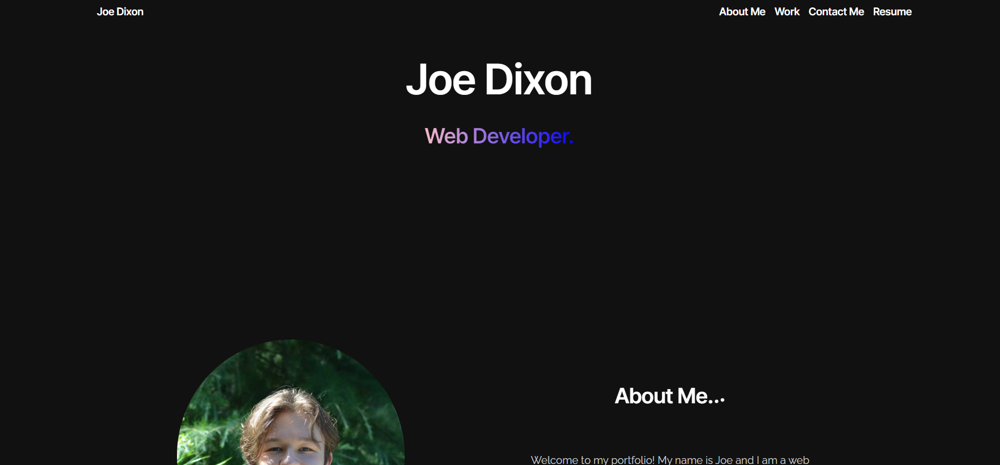
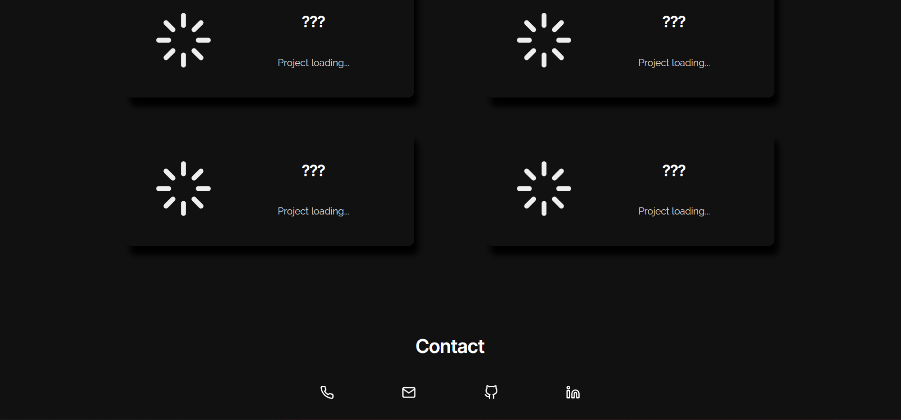

# Joe's Portfolio

This is my personal [portfolio](https://joerdixon.github.io/my-portfolio/)

## Description

This portfolio will have some basic information about me, my experience, projects, and ways to get in touch. It will act as a place for me to stage my projects for prospective clients or employers to look at my work.

## Example

Here is an example of how the top of the website looks.

And here is an example of how the work and contact sections are looking.

## Instalation

N/A, It's a static web page (right now) so just hit the link above!

## License

None.

## Credits

Everything coded and designed by me.